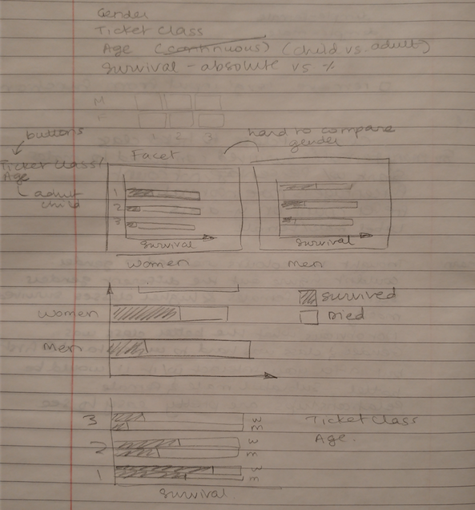
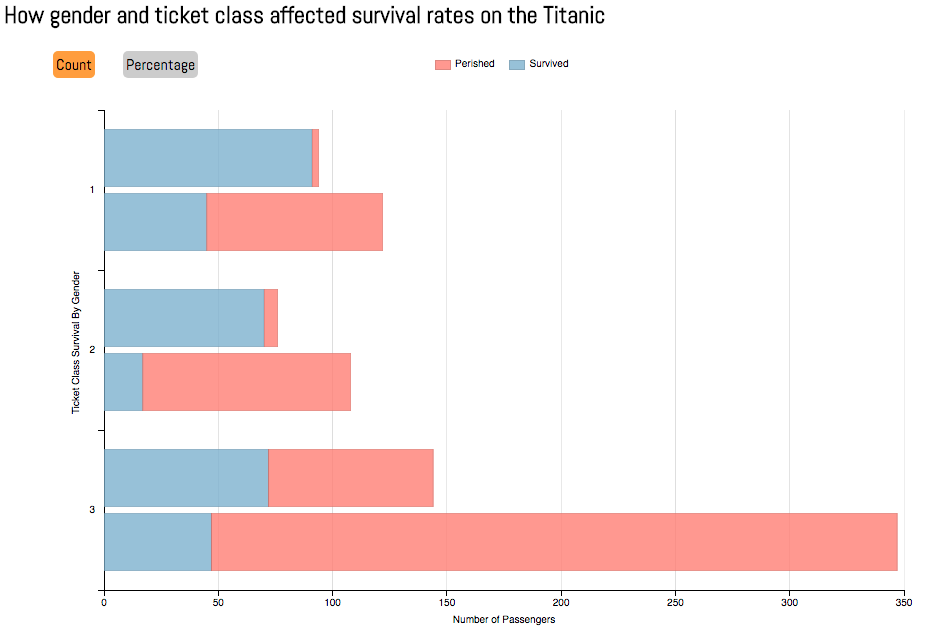
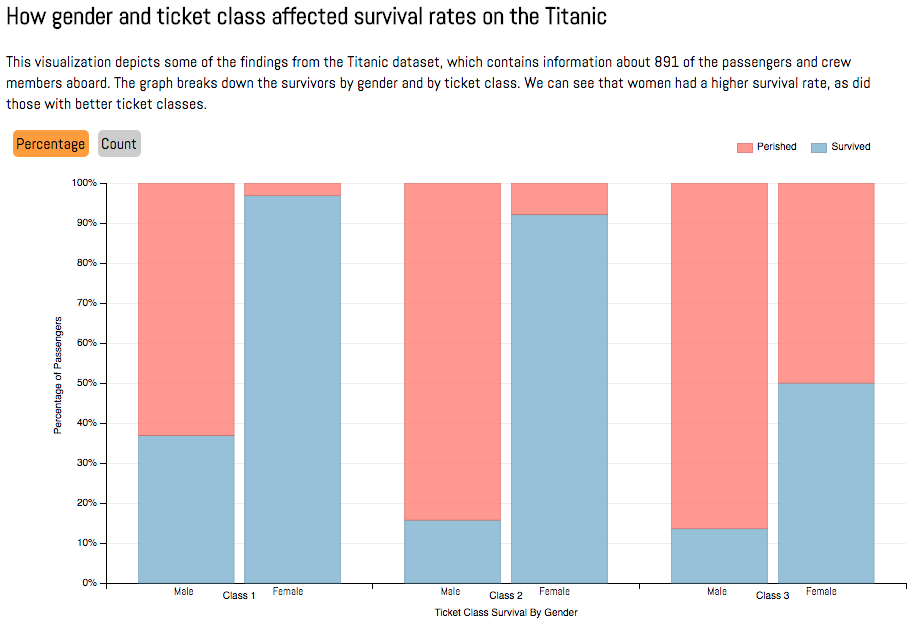

# dand-p7-data-visualization
Data visualization project from Udacity's Data Analyst Nanodegree

<h4>Summary</h4>

This visualization depicts some of the findings from the Titanic dataset, which contains information about 891 of the passengers and crew members aboard. The graph breaks down the survivors by gender and by ticket class. We can see that women had a higher survival rate, as did those with better ticket classes (lower ticket class numbers).

<h4>Design</h4>

Given that this dataset was part of an earlier project, I had a sense of the findings and spent some time thinking about how to best visualize it. I wanted to highlight the difference in survival rate between men and women, as well as the impact of ticket class on survival. My initial thought process can be seen in the sketch below.

<h5>Intitial sketch of the data visualization:</h5>

I started by first putting together the grouped horizontal bar chart and then figuring out how to add the interactivity through the use of the "Count" and "Percentage" buttons. The bar charts were stacked based on survival and grouped based on gender so that the male vs. female survival rates could be compared easily.

<h5>First version of the data visualization:</h5>

After getting feedback on the first version of the graph I modified several aspects, namely:
- Switched from a horizontal to a vertical bar chart
- Added labels to the male and female bars
- Added a description to the visualization
- Made the percentage view the initial view

<h5>Second version of the data visualization:</h5>

<h4>Feedback</h4>

<h4>Resources</h4>
- http://dimplejs.org/examples_viewer.html?id=bars_horizontal_grouped_stacked
- https://stackoverflow.com/questions/32232518/how-to-change-the-order-of-grouped-bar-chart-in-dimple
- https://classroom.udacity.com/nanodegrees/nd002/parts/00213454010/modules/318423863275460/lessons/3066258748/concepts/31058087130923
- https://www.w3schools.com/css/css_positioning.asp
- https://stackoverflow.com/questions/22452112/nvd3-clear-svg-before-loading-new-chart
- https://stackoverflow.com/questions/21990857/d3-js-how-to-get-the-computed-width-and-height-for-an-arbitrary-element

